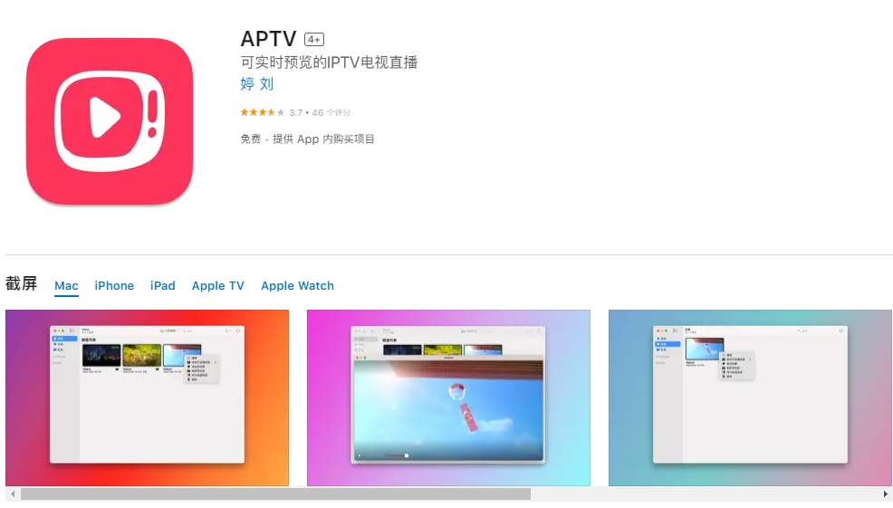
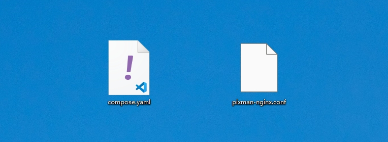
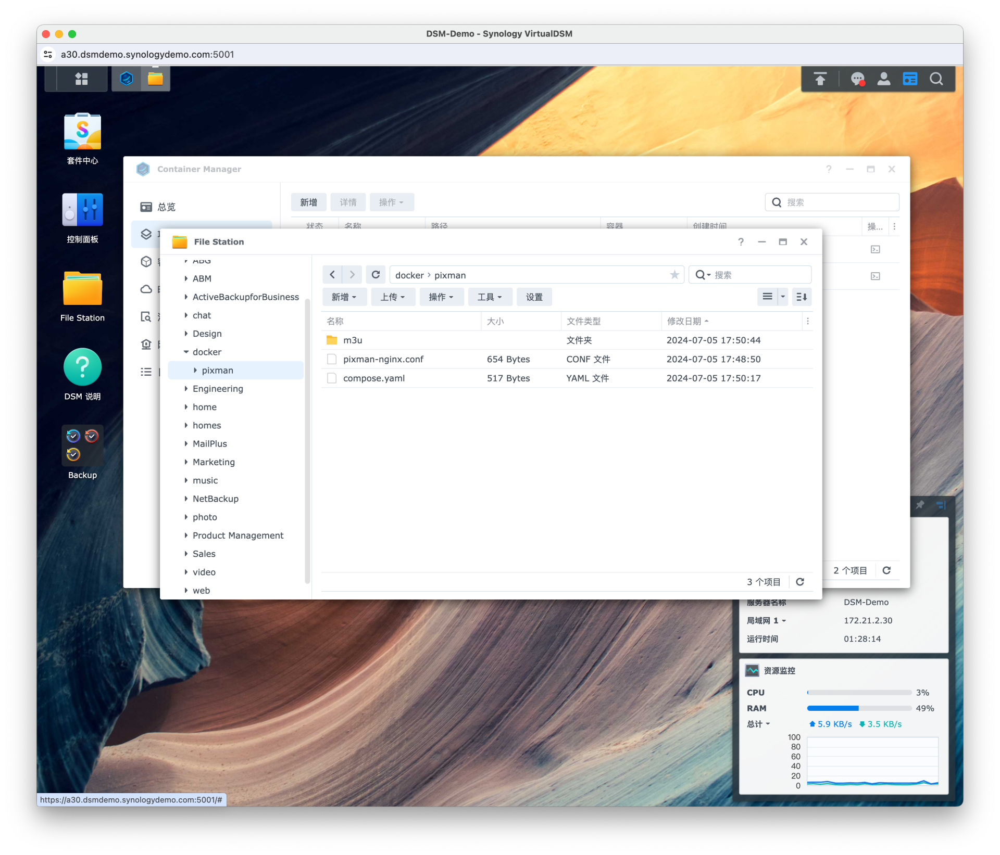
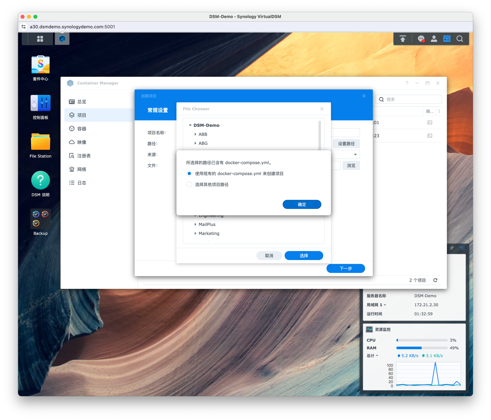
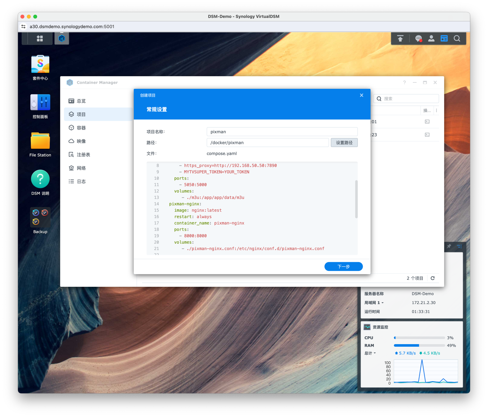
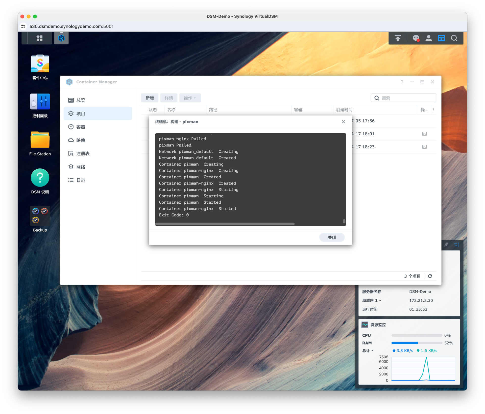

# 仓库简介

机缘巧合，朋友推荐。在我看来，pixman是一个方便各位同好订阅各种已经被大佬调整好了的（免去ipv6以及梯子烦恼）的源的一个docker，它的订阅方式非常简单方便。

#### 总而言之，纯属个人捣鼓，总结众多前辈的经验，旨在帮助各位同好能快速配置好APTV的基础使用。
---


## 一、前期硬件及软件还有知识准备

### 1. 硬件及软件准备 （请依据个人情况进行调整） 
 
* **APTV Pro （iPhone 15 Pro + Apple TV 7）**


#### 服务器及软件 
* **群晖** DSM7.2  
* 安装 **Container Manager**
---

### 2. 知识储备（Reference写在前头，以表尊敬）  
这里就要Refer大佬们原本的教程文档了，如果你动手能力极强，可以直接参考大佬们的教程：  
* Pixman作者Coding大佬的论坛及使用教程
> [Docker 镜像 pixman/pixman 使用说明](https://pixman.io/topics/17)
* 如果你和我一样使用群晖来作为docker载体，我建议你直接看下文：
> [在群晖 Synology 上运行 pixman 及 nginx](https://pixman.io/topics/14)   
  
<br>当然，如果你觉得你看不明白，那就直接看我以下食用方法（**仅仅适用于群晖系统,如果你动手能力强，各种NAS系统其实也差不多**）

---

## 二、简易食用方法
##### 1. 下载 `compose.yaml`以及`pixman-nginx.conf`文档

这个`compose.yaml`文档你可以理解成是一个自动安装`pixman`和`pixman-nginx`的脚本,接下来~~可能需要修改它（你懒就不用，我都改好了）~~。
而`pixman-nginx.conf`则是pixman-nginx的配置文件，这个文件不用改动。
<br>

##### 2. 修改 `compose.yaml`文档，以调整到符合你的安装环境
这里面主要要修改和注意的是**环境**`environment`当中的内容以及两个内容**端口**`port`的设定  
* **修改`environment`**
  原代码如下:
    ```
    environment:
      - http_proxy=http://192.168.50.50:7890  
      - https_proxy=http://192.168.50.50:7890  
      - MYTVSUPER_TOKEN=YOUR_TOKEN  
    ```
    其中，上面两个是代理地址，为了方便，其实可以直接删除，如果你有实际需求，请按自己的设定来更改代理地址。  
    而最后一个，是MYTVSUPER的token获取，[myTV SUPER](https://www.mytvsuper.com/tc/home/)是香港一个很大的网络媒体，它有免费的频道，但大部分需要付费订阅后获取token，所以我提供的`compose.yaml`文件里这三行是被注释掉的，如果你有需要，把`#`删除即可。
<br>
* **修改`port`**
  原代码如下:
    ```
    ports:
      - 4300:5000
    ```
    以及  
    ```
    ports:
      - 7951:5000
    ```
    其中，第一个是控制`pixman本体`的`5000`端口映射，第二个是`pixman-nginx`的`8000`端口映射。
    原代码中`4300`为`5050`，`7951`为`8000`，但是在测试过程中，我发现`5050``和8000`端口其实很容易出现早就被其他进程占用的情况。  
    （**我就是，拉取半天失败找不到原因，才发现原因出现在这里**）所以我特地换了两个端口，这两个端口很难和其他进程有相冲突的情况。  
    <br>
    >**如果想换也可以自己换，如果懒，直接用我的文件就行。**

<br>

##### 3. 将以上两个文档拖入DSM中
在`DSM`的 **File Station** 打开 **docker** 目录 (你如果安装了一些软件或者Cotainer Manager以后，它会自动创建一个docker文件夹在你的目录里)，然后新建一个 pixman 文件夹，将以上两个文档都拖入其中。  

<br>
**PS:** ~~原教程中还有一步，创建一个**m3u**文件夹，用于储存m3u文件，其实没用，所以如果你没有这方面的需求，就不用创建了。~~
<br>

##### 4. 在Container Manager中创建项目并启动项目（以下内容均摘自Coding大佬的教程中，因为他写的够好了）

1. 打开套件 Container Manager，新增项目，项目名称随便写，路径选择 docker/pixman，因为我们已经预先创建好了 compose.yaml 文件，所以选择 使用现有的 docker-compose.yml 来创建项目。



2. 然后点击下一步，~~网站门户设置~~可以不管，点击完成，等待项目构建


##### 5.完成Docker的搭建，开始订阅，享受
参考以下订阅地址，将订阅地址根据你的服务器来修改相对应的参数，即可完成订阅！

### 到这里，保证Docker成功运行，就可以不用管Docker了，只需要关注你的APTV就行了。

---
## 三、订阅

简单来说，你只需要**制作订阅链接**，并使用**APTV**的**订阅链接**功能，订阅该链接，即可完成。

### 订阅链接的组成
首先你要了解订阅链接的组成，一般来说如下图所示

|`http://192.168.1.1:4300/4gtv.m3u`|
| http:// | 192.168.1.1 |:4300| 4gtv.m3u |
|  ----  | ----  | ----  | ----  |
| HTTP协议前缀 | 你的服务器(DSM) **IP**|前面提到的`pixman本体`**端口**| 想订阅的媒体后缀|

### 订阅的媒体推荐
经过尝试，以下几个订阅链接将极大程度上解决常见m3u链接的：**~~网络延迟问题~~，~~IPV6需求问题~~，~~清晰度不高问题~~，~~节目不全问题~~**

以下几个链接几乎涵盖所有需求，再多你也看不完啊，**秉承够用就行原则！**
>以下链接均来自[Coding大佬的论坛](https://pixman.io/),如果侵权，请联系本人删除，本资料仅供学习与交流使用，请勿用于商业用途。

|媒体|媒体后缀|碎碎念|
|  ----  | ----  | ----  |
| 大陆媒体（江苏移动魔百盒） | tptv_proxy.m3u  | 推荐，除了一堆地方和低清频道，中央台频道质量都不错，码率较高|
| ~~大陆媒体（移动iTV）~~ | ~~itv_proxy.m3u~~  | ~~节目太多了，缓冲慢，清晰度不高，一个频道有好多个信道（普通，50Hz，HEVC）看不过来，没必要~~|
| 台湾省媒体（四季線上 4GTV/LITV 整合） | 4gtv.m3u | 台湾省的媒体几乎都包含了，延迟很低，效果清晰，够用，好评！|
| 香港特别行政区媒体 （stream-link） | [stream-link](https://www.stream-link.org/)| 不适用以上规则，请使用浏览器打开链接，仔细阅读其要求后使用|

<br>另外，推荐 **Github YanG-1989** 大佬的[m3u仓库](https://github.com/YanG-1989/m3u)及他的[订阅集合网站](https://yang-1989.eu.org/)

---
### 常见问题
暂时有的问题我已经帮你解决完了，闭眼用就行。

如果还有问题，那你就仓库左上角发起请求or联系我的邮箱 stevenleo0430@gmail.com   
（我觉得我写的已经够细了，还有问题也和这个教程没关系）

---
### 更新记录 （应该也不会更新了，只有可能修改一下订阅的后缀）    
* 2024.10.15  
仓库启动之日，张口喂饭之时


### 再次声明「佛曰需要」
* 本资料中的所有资源均来自网络，仅作为爱好者的收集和分享之用，版权归原作者或原版权方所有。  
* 如有侵权，请联系本人删除。本资料仅供学习与交流使用，请勿用于商业用途。
* 我很胆小脆弱，你要指出illegal，我谢谢你，并且会立马删库跑路，我根正又苗红，热爱祖国热爱党！
